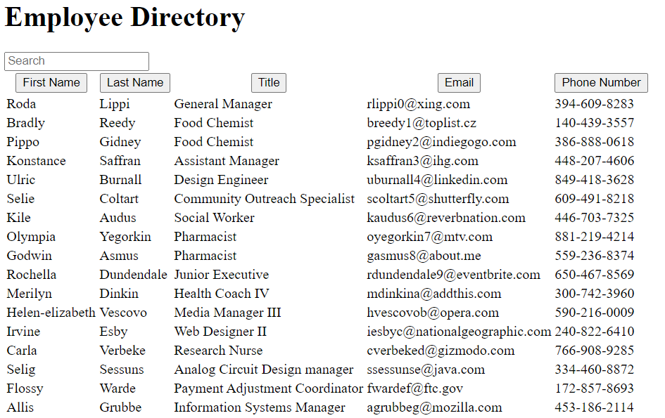

# user-directory

## Description

A simple app that allows the user to sort an employee directory or search.

Link to live site: [budget-tracker](https://safe-tundra-10565.herokuapp.com/)

## Table of Contents

* [Technologies](#Technologies)
* [Installation](#installation)
* [Usage](#usage)
* [Contributing](#contributing)
* [License](#license)
* [Questions](#questions)

## Technologies

* [React](https://reactjs.org/)

## Installation

To install locally run `npm install` to install dependencies.

## Usage

Application is invoked locally with command: `npm start`

## License

MIT License

Copyright (c) Trever Oveson

## Contributing

When contributing to this repository, please first discuss the change you wish to make via issue, email, or any other method with the owner(s) of this repository before making a change.

## Questions

For any questions the author(s) can be contacted at:

### Trever Oveson

GitHub: [toveson](https://github.com/toveson)

Email: toveson9522@gmail.com

I would also like to give a thank you to [Clarissa](https://github.com/clarissareeve) and [Walter](https://github.com/ReddPhoenix) for their input and help.